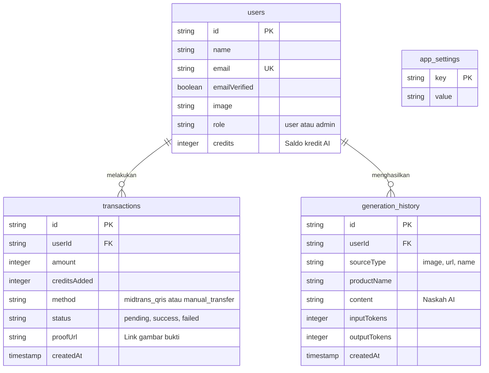
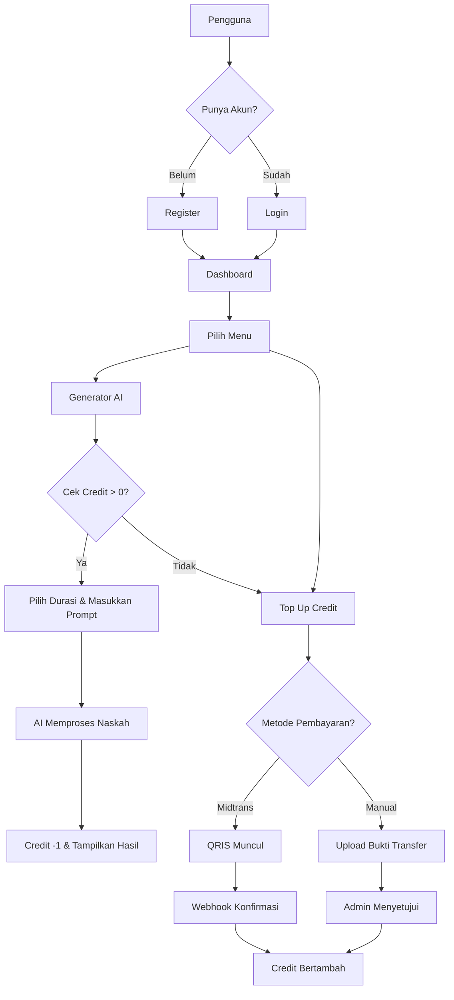

# 🚀 Dokumen Kebutuhan Produk (PRD)

**Nama Proyek:** VO & Script Generator SaaS  
**Jenis:** Web Application (SaaS)  
**Deskripsi:** Aplikasi pembuat naskah video TikTok/Reels berbasis AI dengan sistem *credit* prabayar. Memiliki fitur *scraping* URL produk sebagai konteks AI, serta sistem pembayaran otomatis (Midtrans QRIS) dan manual.

---

## 1. Aturan & Instruksi Pengembangan

| Aturan | Deskripsi |
|---|---|
| **Keketatan Tech Stack** | Hanya gunakan teknologi yang tercantum di bagian "Tech Stack". |
| **App Router** | Wajib menggunakan Next.js App Router (`app/` directory), bukan Pages router. |
| **TypeScript** | Seluruh logika ditulis dalam TypeScript (`.ts`, `.tsx`) dengan tipe data yang jelas. |
| **Pengerjaan Bertahap** | Kerjakan per fase secara berurutan, tidak sekaligus. |
| **UI/UX** | Replikasi desain *dark mode* referensi menggunakan Tailwind CSS dengan komponen yang bersih. |

---

## 2. Tech Stack

| Kategori | Teknologi |
|---|---|
| **Framework** | Next.js (App Router) |
| **Bahasa** | TypeScript |
| **Styling** | Tailwind CSS + Lucide React (Icons) |
| **Database** | PostgreSQL |
| **ORM** | Drizzle ORM (`drizzle-orm`, `drizzle-kit`) |
| **Autentikasi** | Better Auth (`better-auth`) dengan Drizzle adapter |
| **Penyedia AI** | Google Gemini API + DeepSeek API |
| **Web Scraping** | Cheerio (`cheerio`) untuk *parsing* URL produk |
| **Pembayaran** | Midtrans Node.js SDK (`midtrans-client`) |
| **Penyimpanan** | Local filesystem (`public/uploads/`) untuk bukti transfer manual |
| **Integrasi Eksternal** | Context7 MCP Server (untuk manajemen *library/docs*) |

---

## 3. Skema Database

*(Catatan: Tabel standar dari Better Auth seperti `session`, `account`, dan `verification` juga diimplementasikan).*

---

## 4. Alur Kerja Aplikasi (Workflow)

---

## 5. Fitur Inti

### A. Modul Generator AI (`/generator`)
1. **Input Pengguna:** Menyediakan input URL Produk/Nama, Nada Bahasa (*Tone*), Target Audiens, dan **Durasi Video** (15 detik, 30 detik, 60 detik, 90 detik).
2. **Fleksibilitas Naskah:** Parameter durasi diubah menjadi rentang jumlah kata dinamis (tanpa batasan karakter kaku) agar AI lebih kreatif dan natural.
3. **Web Scraping:** Melakukan *fetch* URL target menggunakan Cheerio untuk mengambil konteks `<title>` dan `<meta description>`.
4. **Validasi Saldo:** Memastikan `users.credits > 0` sebelum `fetch` ke API AI. Jika berhasil, saldo dikurangi 1.

### B. Modul Pembayaran & Langganan
1. **Midtrans QRIS (Otomatis):** Pengguna memindai QRIS, lalu *webhook* (`/api/webhooks/midtrans`) secara otomatis mengkonfirmasi transaksi dan menambah *credit*.
2. **Transfer Manual:** Pengguna mengunggah bukti bayar, transaksi berstatus *pending* hingga divalidasi admin.

### C. Modul Dashboard Admin (`/admin`)
1. **Manajemen Transaksi:** Melihat seluruh transaksi dan menyetujui transaksi manual.
2. **Manajemen Pengguna:** Menambah/mengurangi *credit* pengguna secara bebas.
3. **Pengaturan Sistem:** Mengganti *provider* AI (Gemini atau DeepSeek) dan mengatur API Key.

---

## 6. Fase Implementasi
- **Fase 1:** Persiapan Proyek & Autentikasi (Selesai)
- **Fase 2:** *Slicing* UI/Frontend (Selesai)
- **Fase 3:** Mesin AI & Scraping (Selesai, termasuk perbaikan parameter durasi dan integrasi Context7 MCP)
- **Fase 4:** Payment Gateway & Admin (Selesai)