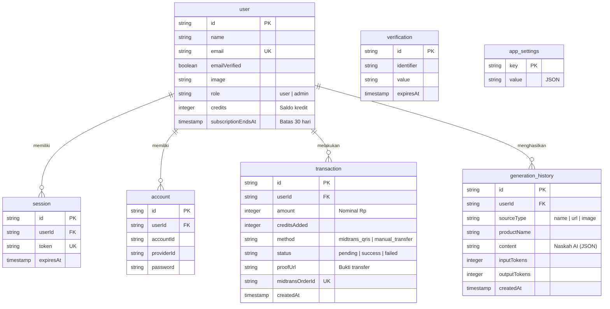
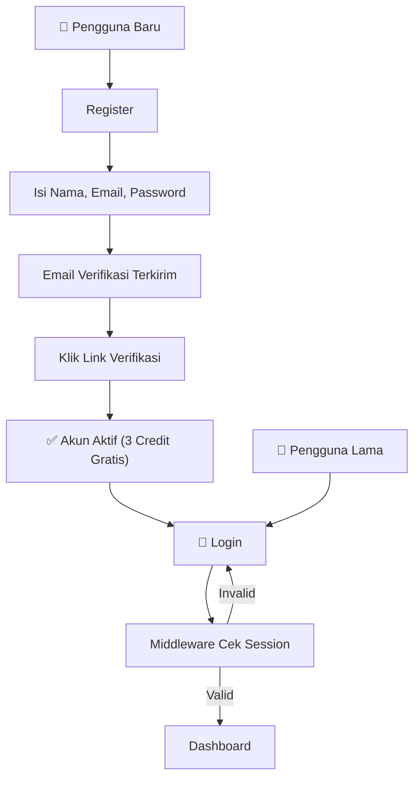
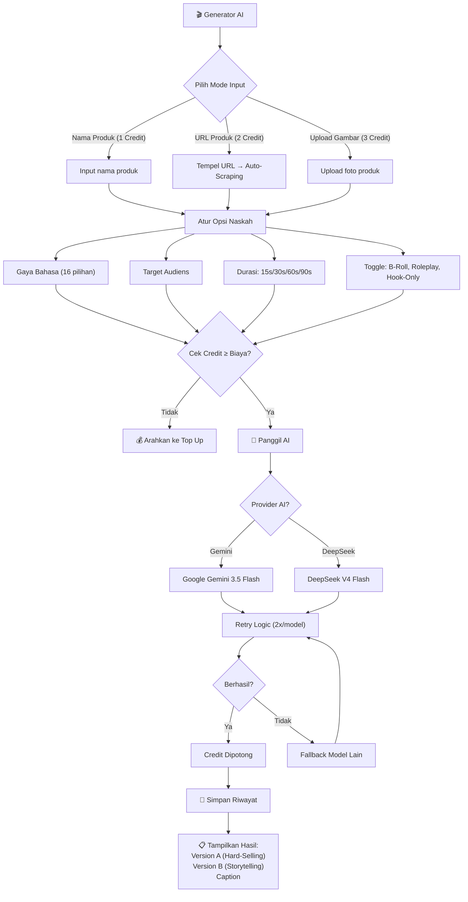
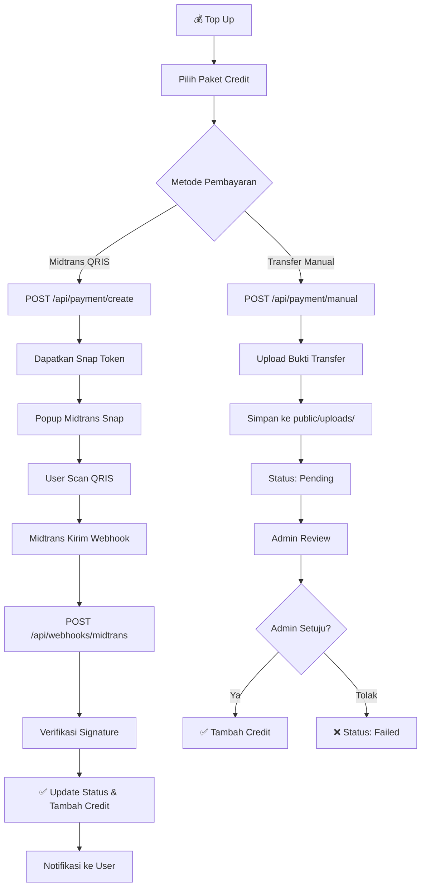
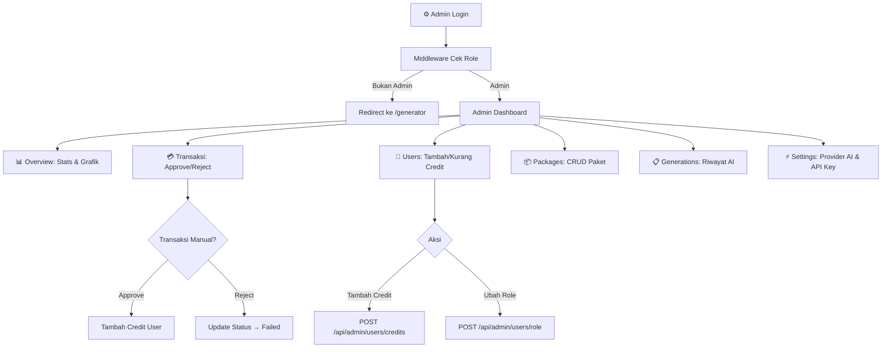

# 🚀 Dokumen Kebutuhan Produk (PRD) — ScriptFlow

**Nama Proyek:** ScriptFlow
**Jenis:** Web Application (SaaS)
**Deskripsi:** Aplikasi pembuat naskah video TikTok/Reels/Shorts berbasis AI dengan sistem *credit* prabayar masa aktif 30 hari. Dilengkapi *scraping* URL produk, 3 mode input (nama/URL/gambar), dan sistem pembayaran terintegrasi (Midtrans QRIS + Transfer Manual).

---

## 1. Aturan & Instruksi Pengembangan

| Aturan | Deskripsi |
|---|---|
| **Tech Stack Ketat** | Hanya gunakan teknologi yang tercantum di bagian "Tech Stack". |
| **App Router** | Wajib menggunakan Next.js App Router (`app/` directory), bukan Pages Router. |
| **TypeScript** | Seluruh logika ditulis dalam TypeScript (`.ts`, `.tsx`) dengan tipe data eksplisit. |
| **Pengerjaan Bertahap** | Kerjakan per fase secara berurutan, tidak sekaligus. |
| **Dark Mode** | Desain *dark mode* menggunakan Tailwind CSS dengan komponen yang bersih. |

---

## 2. Tech Stack

| Kategori | Teknologi |
|---|---|
| **Framework** | Next.js 16 (App Router) |
| **Bahasa** | TypeScript |
| **Styling** | Tailwind CSS 4 + Lucide React (Icons) + Framer Motion |
| **Database** | PostgreSQL 16 |
| **ORM** | Drizzle ORM (`drizzle-orm`, `drizzle-kit`) |
| **Autentikasi** | Better Auth (`better-auth`) dengan Drizzle adapter |
| **AI** | Google Gemini API (`@google/genai`) + DeepSeek API (HTTP) |
| **Web Scraping** | Cheerio (`cheerio`) |
| **Pembayaran** | Midtrans Node.js SDK (`midtrans-client`) |
| **Penyimpanan** | Local filesystem (`public/uploads/proofs/`) untuk bukti transfer |
| **Tabel Admin** | TanStack React Table (`@tanstack/react-table`) |

---

## 3. Skema Database

---

## 4. Alur Kerja Aplikasi

### 4.1 Alur Registrasi & Autentikasi

### 4.2 Alur Generator AI

### 4.3 Alur Pembayaran

### 4.4 Alur Admin

---

## 5. Fitur Inti

### A. Modul Generator AI (`/generator`)
1. **3 Mode Input:** Nama produk (1 credit), URL produk + auto-scraping (2 credit), upload gambar (3 credit).
2. **16 Gaya Bahasa:** Casual Gen-Z, Hard Selling, Storytelling, Educational, Savage, ASMR, Elegant, Mystery, POV, Brutal Review, Challenge, Tips & Trick, Breaking News, Pantun, Motivational, Rap.
3. **Opsi Durasi Dinamis:** 15s (40-50 kata), 30s (80-100 kata), 60s (150-180 kata), 90s (230-260 kata) — rentang kata, bukan batasan karakter kaku.
4. **Web Scraping:** Fetch URL target dengan Cheerio → ekstrak `<title>`, `<meta description>`, dan teks body.
5. **Dual-Model AI:** Gemini 3.5 Flash (teks + gambar) dan DeepSeek V4 Flash (teks). Otomatis fallback ke Gemini jika input gambar.
6. **Retry Logic:** 2 kali percobaan per model, fallback ke model alternatif jika gagal.
7. **Output:** Version A (Hard-Selling), Version B (Storytelling), Caption. Masing-masing dengan arahan B-Roll.

### B. Modul Pembayaran & Langganan
1. **Midtrans QRIS (Otomatis):** Snap token → popup pembayaran → webhook konfirmasi → credit otomatis bertambah.
2. **Transfer Manual:** Upload bukti → status pending → admin approve/reject.
3. **Paket 30 Hari:** Credit berlaku dalam masa aktif 30 hari sejak pembelian (`subscriptionEndsAt`).

### C. Modul Admin (`/admin`)
1. **Overview:** Statistik pengguna, pendapatan, transaksi pending, pendaftar baru.
2. **Transaksi:** Tabel seluruh transaksi + approve/reject untuk transfer manual.
3. **Users:** Tabel pengguna + tambah/kurang credit + ubah role.
4. **Packages:** CRUD paket top-up (disimpan di `app_settings`).
5. **Generations:** Riwayat generasi AI seluruh pengguna dengan token tracking.
6. **Settings:** Pilih provider AI (Gemini/DeepSeek), atur API key, dan konfigurasi Midtrans.

---

## 6. API Endpoints

| Endpoint | Method | Deskripsi |
|---|---|---|
| `/api/auth/[...all]` | * | Better Auth handler (login, register, session, verifikasi) |
| `/api/generate` | POST | Generate naskah AI (auth, cek credit, panggil AI, simpan) |
| `/api/scrape` | POST | Scrape metadata URL produk (Cheerio) |
| `/api/history` | GET, DELETE | Riwayat generasi user |
| `/api/payment/create` | POST | Buat transaksi Midtrans Snap |
| `/api/payment/manual` | POST | Upload bukti transfer manual |
| `/api/webhooks/midtrans` | POST | Webhook notifikasi Midtrans |
| `/api/admin/stats` | GET | Statistik dashboard admin |
| `/api/admin/users` | GET | Daftar semua user |
| `/api/admin/users/credits` | POST | Tambah/kurang credit user |
| `/api/admin/users/role` | POST | Ubah role user |
| `/api/admin/transactions` | GET | Daftar semua transaksi |
| `/api/admin/transactions/approve` | POST | Approve/reject transaksi manual |
| `/api/admin/packages` | GET, POST | CRUD paket top-up |
| `/api/admin/settings` | GET, POST | Pengaturan AI & Midtrans |
| `/api/admin/notifications` | GET | Notifikasi admin (pending count) |
| `/api/user/notifications` | GET | Notifikasi user (top-up sukses) |
| `/api/test-gemini` | GET | Tes konektivitas Gemini API |

---

## 7. Fase Implementasi

| Fase | Deskripsi | Status |
|---|---|---|
| **Fase 1** | Setup Proyek, Database, & Autentikasi | ✅ Selesai |
| **Fase 2** | Slicing UI/Frontend (Landing, Dashboard, Admin) | ✅ Selesai |
| **Fase 3** | Mesin AI, Scraping, & Context7 MCP | ✅ Selesai |
| **Fase 4** | Payment Gateway & Panel Admin | ✅ Selesai |
