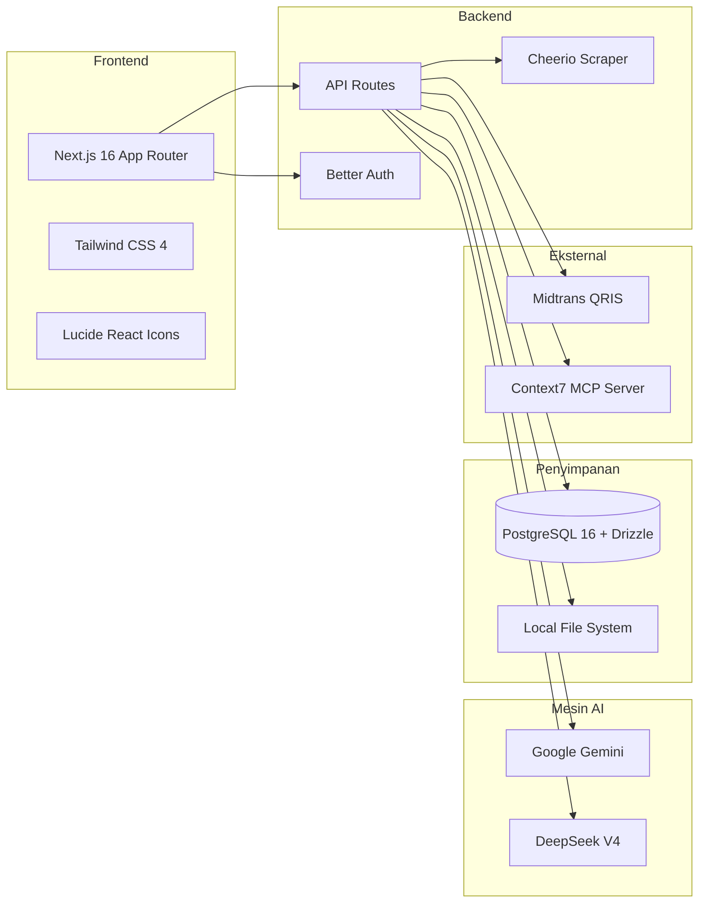
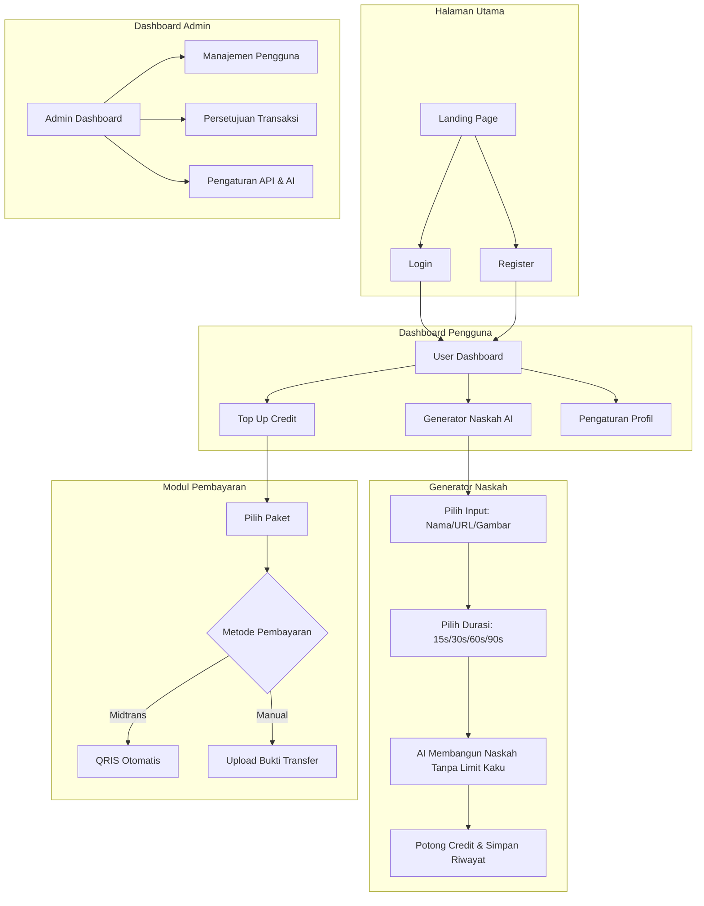

# 🚀 VO & Script Generator SaaS — Laporan Proyek (Progress)

**Pembaruan Terakhir:** Hari ini

---

## 📋 Ringkasan Eksekutif

Aplikasi generator naskah video TikTok/Reels berbasis AI dengan sistem *credit* prabayar, *scraping* URL produk, dan sistem pembayaran terintegrasi (Midtrans QRIS + Transfer Manual).

| Metrik | Nilai |
|--------|-------|
| **Status Saat Ini** | ✅ MVP Selesai Sepenuhnya |
| **Framework** | Next.js 16 (App Router) |
| **Database** | PostgreSQL 16 + Drizzle ORM |
| **Autentikasi** | Better Auth (Email/Password) |
| **Model AI** | Gemini (`gemini-3.5-flash`) + DeepSeek (`deepseek-v4-flash`) |
| **Server Tambahan** | Context7 MCP Server (terinstal via CLI) |

---

## 🏗️ Arsitektur Sistem

---

## 🔄 Alur Aplikasi (Flowchart)

---

## ✅ Status Implementasi per Fase

### Fase 1: Setup Proyek & Autentikasi Dasar
| Tugas | Status | Catatan |
|-------|--------|---------|
| Next.js App Router + Tailwind | ✅ Selesai | Versi 16.2.9 |
| Drizzle ORM + PostgreSQL | ✅ Selesai | Terdapat 7 tabel utama |
| Better Auth (Email/Password) | ✅ Selesai | Menggunakan kolom *custom* `role` & `credits` |

### Fase 2: Slicing UI (Frontend)
| Tugas | Status | Catatan |
|-------|--------|---------|
| Layout Dashboard (Sidebar/Navbar) | ✅ Selesai | Responsif dengan *dark mode* |
| Generator UI & Opsi Durasi | ✅ Selesai | Tombol durasi 15s, 30s, 60s, 90s sudah terpasang |
| Halaman Admin | ✅ Selesai | Tata letak tabel transaksi dan pengguna |

### Fase 3: Mesin AI & Scraping
| Tugas | Status | Catatan |
|-------|--------|---------|
| Integrasi AI (Gemini & DeepSeek) | ✅ Selesai | Auth DeepSeek via kredensial DB sudah diperbaiki |
| Sistem Durasi Fleksibel | ✅ Selesai | Rentang jumlah kata dinamis untuk durasi tertentu tanpa batas kaku |
| Web Scraping (Cheerio) | ✅ Selesai | `/api/scrape` mengambil judul dan deskripsi otomatis |
| Pemasangan Context7 MCP Server | ✅ Selesai | Terhubung dengan `agy` via *Personal Access Token* GitHub |

### Fase 4: Pembayaran & Panel Admin
| Tugas | Status | Catatan |
|-------|--------|---------|
| Midtrans Snap & Webhook | ✅ Selesai | Proses top-up terotomatisasi |
| Persetujuan Transaksi Manual | ✅ Selesai | Tombol setuju di panel Admin |
| Pengaturan Penyedia AI | ✅ Selesai | Admin dapat mengganti model Gemini atau DeepSeek |

---

## 🤖 Model AI yang Digunakan

| Penyedia | ID Model | Tipe | Kapabilitas |
|----------|----------|------|-------------|
| **Google Gemini** | `gemini-3.5-flash` | Utama | Teks + Gambar |
| **DeepSeek** | `deepseek-v4-flash` | Utama | Teks Saja |
*(Catatan: DeepSeek telah disiapkan agar menggunakan versi V4 Flash terbaru).*

---

## 🚧 Catatan Terkini & Rencana Selanjutnya

1. **Perbaikan Durasi AI:** Logika batasan jumlah karakter kaku (*strict*) telah dilepas. AI kini diberikan rentang target kata (misalnya 230-260 kata untuk 90 detik) agar naskah promosi mengalir dengan semangat tanpa terpotong.
2. **Context7 & GitHub Terpasang:** Proyek telah berhasil di-push ke GitHub *origin*, dan `agy` CLI sudah dilengkapi dengan Context7 MCP dan server resmi GitHub MCP.
3. **Penyimpanan (Storage):** Bukti transfer manual masih disimpan di sistem lokal (`public/uploads/`). Disarankan menggunakan penyimpanan *cloud* seperti Supabase Storage atau AWS S3 untuk fase produksi.
