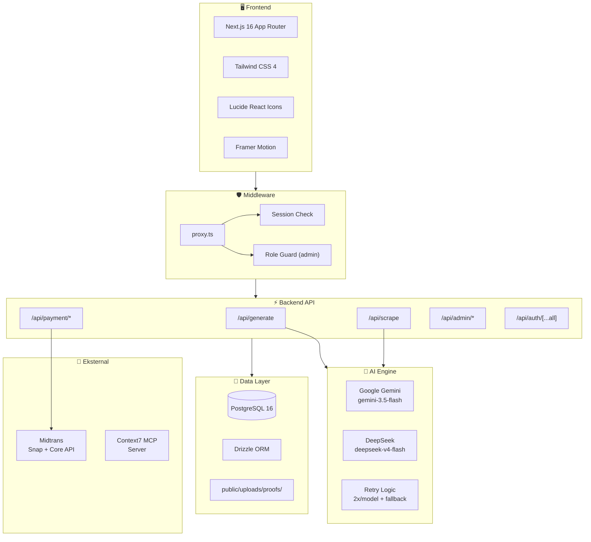
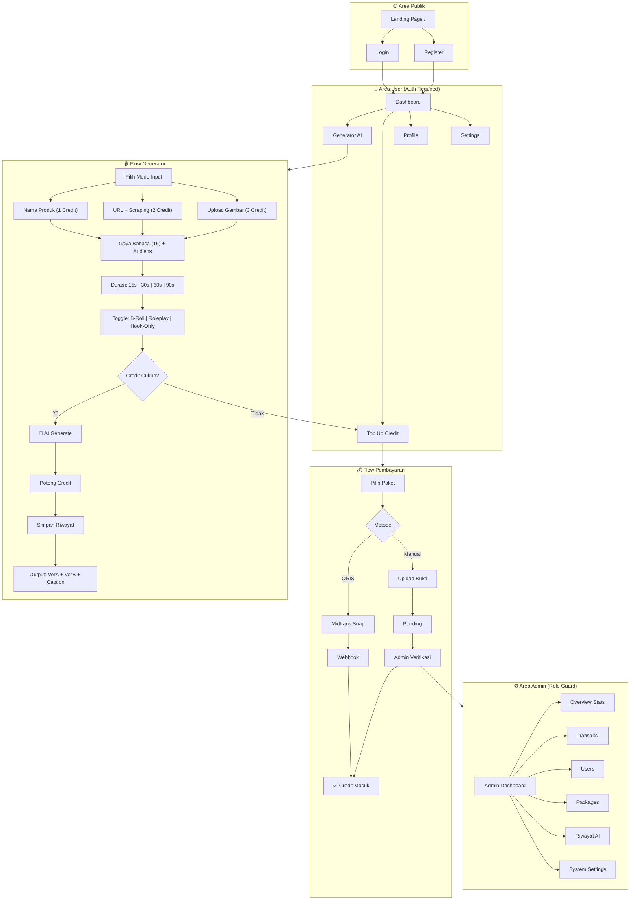
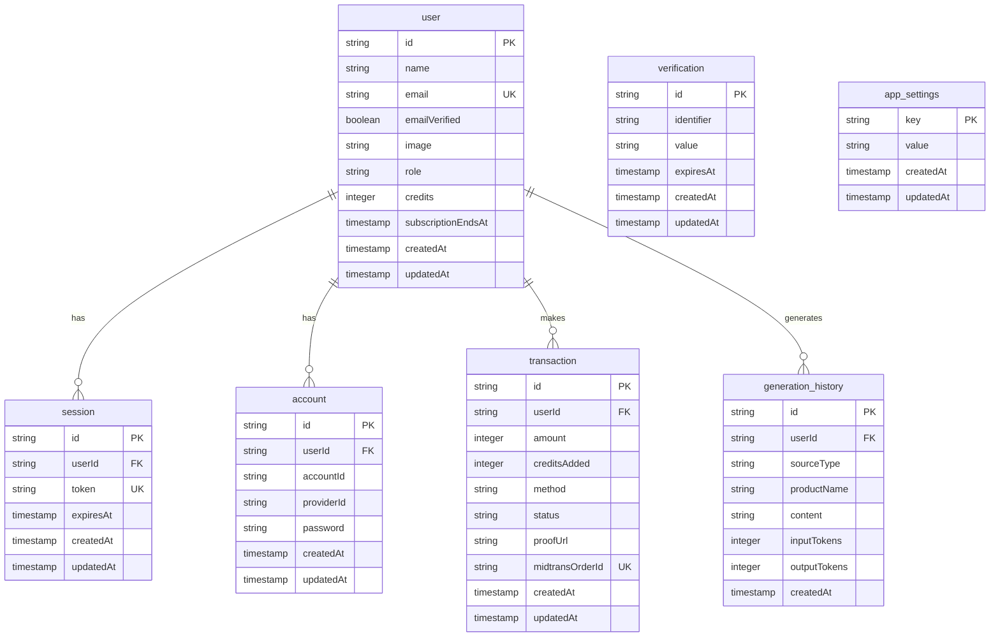

# 🚀 ScriptFlow — Laporan Proyek (Progress)

**Pembaruan Terakhir:** 29 Juni 2026

---

## 📋 Ringkasan Eksekutif

Aplikasi SaaS generator naskah video pendek berbasis AI dengan sistem *credit* prabayar, *scraping* URL produk, 3 mode input, dan sistem pembayaran terintegrasi (Midtrans QRIS + Transfer Manual).

| Metrik | Nilai |
|---|---|
| **Status** | ✅ MVP Selesai Sepenuhnya |
| **Framework** | Next.js 16.2.9 (App Router) |
| **Database** | PostgreSQL 16 + Drizzle ORM 0.45 |
| **Autentikasi** | Better Auth 1.6 (Email/Password + Verifikasi) |
| **AI Model** | Gemini `gemini-3.5-flash` + DeepSeek `deepseek-v4-flash` |
| **Total Halaman** | 13 route (3 public + 5 dashboard + 5 admin) |
| **Total API** | 17 endpoint |
| **Tabel DB** | 7 tabel (3 Better Auth + 4 custom) |

---

## 🏗️ Arsitektur Sistem

---

## 🔄 Alur Aplikasi Lengkap

---

## ✅ Status Implementasi per Fase

### Fase 1: Setup Proyek & Autentikasi

| Tugas | Status | Detail |
|---|---|---|
| Next.js App Router + Tailwind | ✅ Selesai | v16.2.9, Tailwind CSS 4 |
| Drizzle ORM + PostgreSQL | ✅ Selesai | 7 tabel (user, session, account, verification, transaction, generation_history, app_settings) |
| Better Auth (Email/Password) | ✅ Selesai | Custom fields: `role`, `credits`, `subscriptionEndsAt` |
| Middleware Auth Guard | ✅ Selesai | `proxy.ts` — cek session + role-based redirect |
| Seed Data | ✅ Selesai | User + Admin account awal |

### Fase 2: Slicing UI (Frontend)

| Tugas | Status | Detail |
|---|---|---|
| Landing Page | ✅ Selesai | Navbar, Hero, Features, Pricing, Footer |
| Layout Dashboard | ✅ Selesai | Sidebar + DashboardNavbar, responsif, dark mode |
| Generator UI | ✅ Selesai | 3 tab input, 16 gaya bahasa, durasi, toggle mode |
| Halaman Top Up | ✅ Selesai | Pilih paket, modal Midtrans/manual |
| Halaman Profile & Settings | ✅ Selesai | Edit profil, notifikasi, tema |
| Admin Panel UI | ✅ Selesai | 6 halaman: Overview, TX, Users, Packages, Generations, Settings |
| Animasi | ✅ Selesai | Framer Motion pada landing page & transisi |

### Fase 3: Mesin AI & Scraping

| Tugas | Status | Detail |
|---|---|---|
| Integrasi Gemini API | ✅ Selesai | SDK `@google/genai`, fallback model chain |
| Integrasi DeepSeek API | ✅ Selesai | Direct HTTP, `deepseek-v4-flash` |
| Dual-Model System | ✅ Selesai | Gemini untuk teks+gambar, DeepSeek untuk teks |
| Retry Logic | ✅ Selesai | 2x attempt per model, auto-fallback |
| Web Scraping (Cheerio) | ✅ Selesai | Ekstrak title, meta description, body text |
| Durasi Fleksibel | ✅ Selesai | Rentang kata dinamis, bukan batasan karakter |
| 16 Gaya Bahasa | ✅ Selesai | Prompt engineering untuk tiap gaya |
| B-Roll & Roleplay Mode | ✅ Selesai | Arahan visual per bait narasi |
| Credit System | ✅ Selesai | Biaya: 1 (nama), 2 (URL), 3 (gambar) |
| Riwayat Generasi | ✅ Selesai | Tracking input/output tokens |
| Context7 MCP Server | ✅ Selesai | Terhubung via GitHub PAT |

### Fase 4: Pembayaran & Panel Admin

| Tugas | Status | Detail |
|---|---|---|
| Midtrans Snap Integration | ✅ Selesai | QRIS otomatis, Snap token, popup |
| Midtrans Webhook | ✅ Selesai | Verifikasi signature, update status |
| Transfer Manual | ✅ Selesai | Upload bukti, simpan lokal |
| Persetujuan Manual | ✅ Selesai | Admin approve/reject transaksi |
| Manajemen User | ✅ Selesai | Tambah/kurang credit, ubah role |
| CRUD Packages | ✅ Selesai | Disimpan di `app_settings` |
| System Settings | ✅ Selesai | Pilih provider AI, API key, Midtrans config |
| Notifikasi Admin | ✅ Selesai | Pending transaction count di navbar |
| Notifikasi User | ✅ Selesai | Top-up sukses di navbar |

---

## 🗄️ Skema Database

---

## 🤖 Model AI

| Provider | Model | Tipe | Kapabilitas | Biaya Credit |
|---|---|---|---|---|
| **Google Gemini** | `gemini-3.5-flash` | Utama | Teks + Gambar | 1-3 |
| **DeepSeek** | `deepseek-v4-flash` | Utama | Teks saja | 1-2 |

**Catatan:**
- Input gambar otomatis menggunakan Gemini (DeepSeek tidak mendukung gambar).
- Retry logic: 2 attempt per model → fallback ke model lain jika gagal.
- Admin dapat mengganti provider default via `/admin/settings`.

---

## 📦 Paket Top-Up

| Nama | Harga | Credit | Populer |
|---|---|---|---|
| **Starter** | Rp 25.000 | 50 | |
| **Creator** | Rp 100.000 | 250 | ⭐ |
| **Agency** | Rp 250.000 | 1.000 | |

---

## 🚧 Catatan & Rencana Selanjutnya

1. **Penyimpanan Cloud:** Bukti transfer masih di `public/uploads/proofs/`. Disarankan migrasi ke Supabase Storage atau S3 untuk produksi.
2. **Email Service:** Verifikasi email saat ini log URL ke console (dev). Perlu integrasi SMTP (Resend, SendGrid) untuk produksi.
3. **Monitoring & Logging:** Belum ada sistem monitoring produksi (error tracking, analytics).
4. **Rate Limiting:** Belum ada pembatasan rate pada API routes.
5. **Testing:** Belum ada unit/integration test.
6. **CI/CD:** Pipeline deployment belum dikonfigurasi.
7. **Sistem Langganan 30 Hari:** Kolom `subscription_ends_at` sudah ada di database. Logika pengecekan masa aktif perlu diintegrasikan ke middleware/API.
